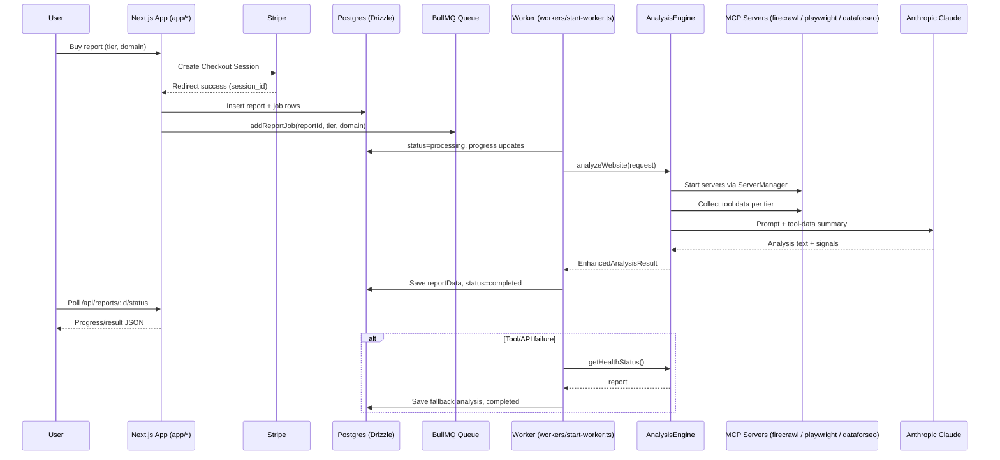

# Architecture & Agentic Reporting

## System Diagram

## Agentic Report Generation Flow
- Checkout and queueing: `app/api/reports/checkout/route.ts` creates Stripe session. On success, `app/api/reports/checkout/success/route.ts` validates payment, inserts `reports` and `report_jobs` rows, then enqueues `report-generation` via `lib/queue/report-queue.ts`.
- Worker orchestration: `lib/workers/report-worker.ts` marks status=processing, streams progress to BullMQ and `report_jobs`, and calls `AnalysisEngine.analyzeWebsite`.
- Tiered tool setup: `lib/mcp/analysis-engine.ts` chooses prompts (`lib/prompts/*`) and initializes `ClaudeMcpWrapper`.
- Tool execution (agentic loop): `lib/mcp/claude-mcp-wrapper.ts` starts MCP servers from `.mcp.json` via `lib/mcp/server-manager.ts`, then:
  - Firecrawl: crawl/extract content (all tiers).
  - Playwright: UX/accessibility/perf signals (pro/elite/tasklist).
  - DataForSEO: technical SEO/keywords (elite/tasklist).
  It composes a tool-data summary, augments the prompt, and calls Claude (`claude-3-5-sonnet-20241022`).
- Result shaping: Recommendations/score/issues are extracted, tier-specific formatting applied; `report-worker` persists `reportData` and sets status=completed, or generates a structured fallback on failure.
- Status API: Clients poll `GET /api/reports/[id]/status` for job progress and final JSON.

## Feedback & Recommendations
- Reliability: Good fallbacks. Add DB uniqueness on `reports.stripePaymentId` for idempotency and guard double-queues at DB level.
- BullMQ config: `Worker` uses stall/lock correctly; remove `stalledInterval` from `defaultJobOptions` (not a Queue option). Keep `lockDuration` ≥ worst-case analysis.
- Observability: Add structured logs and tracing IDs (reportId) across Web/Worker/AE; expose a minimal health endpoint for MCP status and queue depth.
- Testing: Mock Anthropic/MCP; add unit tests for parsing (recommendations/score extraction) and an integration test that runs the worker against a stub.
- Performance: Cache Firecrawl/SEO results by domain for short TTL to reduce cost; consider deduping concurrent jobs for same domain+tier.
- Security: Ensure secrets are only in `.env`; validate domain inputs rigorously; avoid logging scraped PII; bound Claude token usage per tier.
