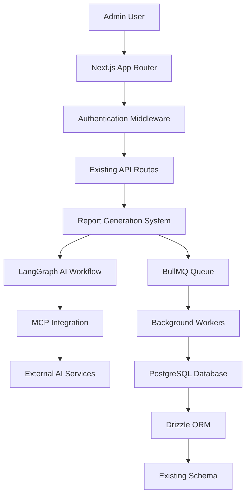
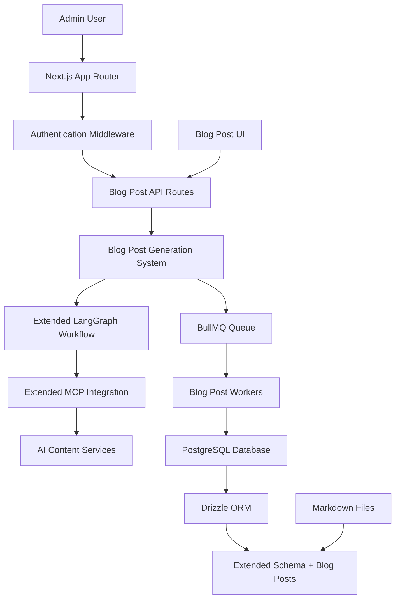
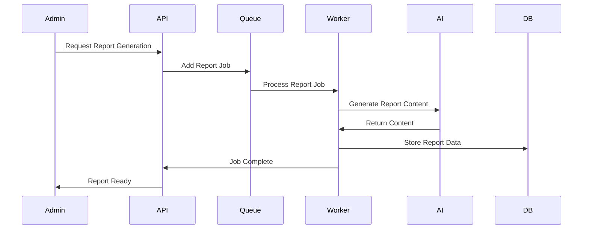
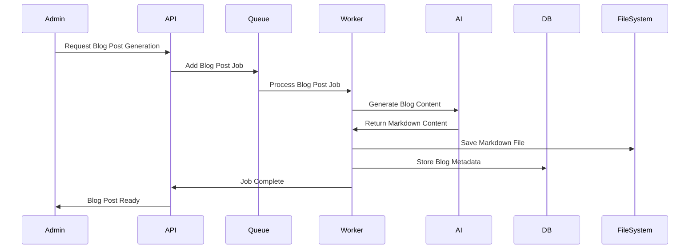
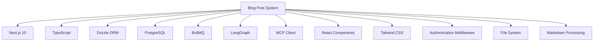

# Technical Implementation Blueprint: Blog Post Generation System

## 1. Current vs Target Analysis

### 1.1 Current System Architecture



### 1.2 Target System Architecture



### 1.3 Current Data & Logic Flow



### 1.4 Target Data & Logic Flow



### 1.5 Summary of Improvements

- **AI Content Generation** – Leverages existing LangGraph infrastructure for blog post creation
- **Markdown File Management** – Generates and stores blog posts as markdown files for easy version control
- **Admin-Only Interface** – Separate admin interface for content management
- **Lead Generation Integration** – Blog posts include CTAs for site auditing service
- **Background Processing** – Uses existing BullMQ for reliable content generation

## 2. System Components

### 2.1 Frontend Components

- **BlogPostGenerator** – Admin interface for triggering blog post generation
- **BlogPostEditor** – Markdown editor for reviewing and editing generated content
- **BlogPostManager** – Admin dashboard for managing existing blog posts
- **PainPointSelector** – Interface for selecting target pain points
- **SEOOptimizer** – Component for managing SEO metadata

### 2.2 Backend Components

- **BlogPostService** – Core service for blog post operations
- **BlogPostWorker** – Background worker for content generation
- **BlogPostQueue** – BullMQ queue for job management
- **BlogPostPrompt** – Extended prompt system for content generation
- **BlogPostGraph** – Extended LangGraph workflow for blog posts

## 3. Data Models

### 3.1 Database Schema

```sql
-- Blog Posts Table
CREATE TABLE blog_posts (
    id UUID PRIMARY KEY DEFAULT gen_random_uuid(),
    title VARCHAR(255) NOT NULL,
    slug VARCHAR(255) UNIQUE NOT NULL,
    content_markdown TEXT NOT NULL,
    seo_title VARCHAR(255),
    seo_description TEXT,
    seo_keywords TEXT[],
    pain_point_category VARCHAR(100),
    status VARCHAR(20) DEFAULT 'draft',
    published_at TIMESTAMP,
    created_at TIMESTAMP DEFAULT NOW(),
    updated_at TIMESTAMP DEFAULT NOW(),
    created_by UUID REFERENCES users(id)
);

-- Blog Post Metadata Table
CREATE TABLE blog_post_metadata (
    id UUID PRIMARY KEY DEFAULT gen_random_uuid(),
    blog_post_id UUID REFERENCES blog_posts(id) ON DELETE CASCADE,
    meta_key VARCHAR(100) NOT NULL,
    meta_value TEXT,
    created_at TIMESTAMP DEFAULT NOW()
);

-- Pain Point Categories Table
CREATE TABLE pain_point_categories (
    id UUID PRIMARY KEY DEFAULT gen_random_uuid(),
    name VARCHAR(100) NOT NULL,
    description TEXT,
    target_keywords TEXT[],
    is_active BOOLEAN DEFAULT true,
    created_at TIMESTAMP DEFAULT NOW()
);
```

## 4. API Specifications

### 4.1 Endpoints

- **POST /api/blog-posts/generate** – Trigger blog post generation
- **GET /api/blog-posts** – List all blog posts
- **GET /api/blog-posts/[id]** – Get specific blog post
- **PUT /api/blog-posts/[id]** – Update blog post
- **DELETE /api/blog-posts/[id]** – Delete blog post
- **GET /api/blog-posts/pain-points** – Get available pain point categories
- **POST /api/blog-posts/[id]/publish** – Publish blog post
- **POST /api/blog-posts/[id]/unpublish** – Unpublish blog post

## 5. Implementation Phases

### Phase 1 – Database & Core Infrastructure

- [ ] Extend database schema with blog post tables
- [ ] Create database migrations
- [ ] Set up blog post queue in BullMQ
- [ ] Create blog post worker structure
- [ ] Extend LangGraph workflow for blog posts

### Phase 2 – AI Integration & Content Generation

- [ ] Extend prompt system for blog post generation
- [ ] Integrate with existing MCP client
- [ ] Implement markdown file generation
- [ ] Create pain point targeting logic
- [ ] Add SEO optimization features

### Phase 3 – API Development

- [ ] Create blog post API routes
- [ ] Implement authentication middleware
- [ ] Add input validation and error handling
- [ ] Create blog post CRUD operations
- [ ] Add publishing/unpublishing functionality

### Phase 4 – Admin Interface

- [ ] Create blog post generator component
- [ ] Build blog post editor interface
- [ ] Implement blog post manager dashboard
- [ ] Add pain point selector component
- [ ] Create SEO optimizer interface

### Phase 5 – Integration & Testing

- [ ] Integrate with existing authentication
- [ ] Add CTA integration for site auditing
- [ ] Implement comprehensive testing
- [ ] Add monitoring and logging
- [ ] Deploy and monitor

## 6. Technical Risks & Mitigation

| Risk | Mitigation |
|------|------------|
| AI content quality inconsistency | Implement content review workflow and quality checks |
| Background job failures | Use existing BullMQ retry logic and error handling |
| Database schema conflicts | Follow existing migration patterns and test thoroughly |
| Admin interface complexity | Leverage existing UI component patterns |
| SEO optimization accuracy | Integrate with existing SEO tools and validation |

## 7. Testing Strategy

### 7.1 Unit Testing

- Test blog post generation logic with Jest
- Validate markdown file creation
- Test database operations with Drizzle
- Mock AI service responses
- Test queue job processing

### 7.2 Integration Testing

- Test complete blog post generation workflow
- Validate API endpoint functionality
- Test authentication and authorization
- Verify background job processing
- Test database migrations

## 8. Deployment Considerations

- **Environment Variables**: Add AI service credentials and blog post storage paths
- **File Storage**: Configure markdown file storage location
- **Database Migration**: Run schema migrations before deployment
- **Queue Configuration**: Ensure BullMQ is properly configured
- **Monitoring**: Add logging for blog post generation jobs
- **Rollback Strategy**: Maintain database backups and file versioning

---

## Annex A – Dependency Map


